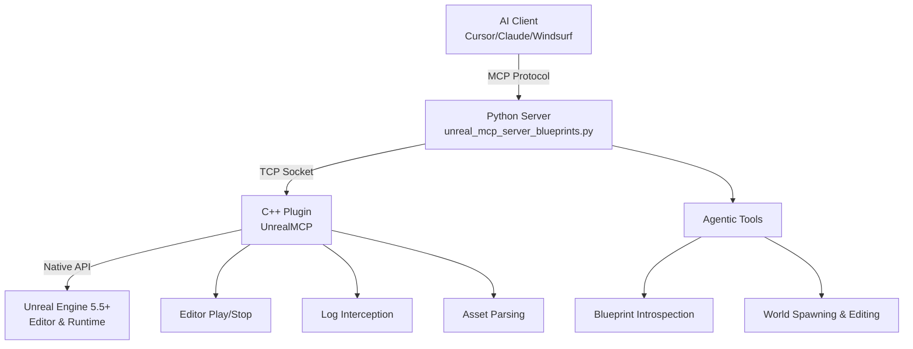

# Unreal MCP Agent 🤖

[](https://www.unrealengine.com/)
[](https://opensource.org/licenses/MIT)

**Connect your AI Agent directly to Unreal Engine 5 via the Model Context Protocol (MCP). Let AI read your Blueprints, spawn and manipulate actors, test your game in PIE, and capture engine logs autonomously.**

> **Credit**: This repository is an advanced, independent evolution originally forked from [Flopperam's unreal-engine-mcp](https://github.com/flopperam/unreal-engine-mcp). While the original project focused heavily on procedural generation algorithms, this project aims to create a fully autonomous Agentic workflow to inspect, debug, and script the engine logic itself.

---

## 🚀 True Agentic Workflow

Unlike traditional procedural generation plugins, **Unreal MCP Agent** gives the AI "eyes" and "hands" inside the Editor.
You don't just ask the AI to "build a house". You can say:
> "Read the variables of `BP_GameplaySettings`, tell me if gravity is too low, spawn a physics crate, run Play-in-Editor, and check the Engine logs to see if it triggers the collision warning."

### ✨ Featured Capabilities

**1. Blueprint Introspection & Analysis**
```bash
# Read variables, structs, inputs, enums and functions from any Blueprint
> "Show me the variables inside the GameplaySettings Blueprint"
→ read_blueprint_functions(blueprint_path="/Game/Blueprints/BP_GameplaySettings")
```

**2. World Manipulation & Editor Control**
```bash
# Spawn actors, control Play-in-Editor (PIE) and read engine logs
> "Place a crate at the center of the room and play the game"
→ spawn_actor(class_path="/Game/Blueprints/BP_Crate", location_x=0.0, location_y=0.0, location_z=0.0)
→ start_play_in_editor()
→ get_editor_logs() # Intercept live errors from the engine!
```

---

## 🛠 Complete Tool Arsenal

| **Category** | **Tools** | **Description** |
|--------------|-----------|-----------------|
| **Blueprint Introspection** | `read_blueprint_struct`, `read_blueprint_functions`, `read_blueprint_enum`, `read_widget_variables`, `read_savegame_blueprint` | Analyze internal blueprint data, logic, and editable variables |
| **Asset Management** | `duplicate_asset`, `read_data_asset`, `read_input_action`, `create_material_instance` | Manipulate and read existing project assets |
| **Actor & Scene Control** | `get_actors_in_level`, `spawn_actor`, `destroy_actor`, `set_actor_transform` | Precise control over scene objects and transforms |
| **Editor Pipeline** | `start_play_in_editor`, `stop_play_in_editor`, `get_editor_logs` | Run games & capture engine errors via AI |

---

## ⚡ Setup

### Prerequisites
- **Unreal Engine 5.5+** 
- **Python 3.12+**
- **MCP Client** (Claude Desktop, Cursor, or Windsurf)

### 1. Installation

**Add Plugin to Your Existing Project**
```bash
git clone https://github.com/oprincipe/unreal-mcp-agent.git
cd unreal-mcp-agent

# Copy the plugin to your Unreal project
cp -r UnrealMCP/ YourProject/Plugins/

# Enable it in the Unreal Editor
Edit → Plugins → Search "UnrealMCP" → Enable → Restart Editor
```

### 2. Launch the MCP Server

```bash
cd Python
# Launch the Agentic Server
uv run unreal_mcp_server_blueprints.py
```

### 3. Configure Your AI Client

Add this to your MCP configuration:

**Cursor**: `.cursor/mcp.json`
**Claude Desktop**: `~/.config/claude-desktop/mcp.json` 
**Windsurf**: `~/.config/windsurf/mcp.json`

```json
{
  "mcpServers": {
    "unrealMCP": {
      "command": "uv",
      "args": [
        "--directory", 
        "/absolute/path/to/unreal-mcp-agent/Python",
        "run", 
        "unreal_mcp_server_blueprints.py"
      ]
    }
  }
}
```

### 4. Start Automating!

```text
> "What are the boolean variables inside BP_PlayerState?"
> "Spawn BP_Enemy at 100, 200, 0"
> "Start the game, wait, and tell me if any errors were printed in the logs."
```

---

## Architecture



---

## License
**MIT License** - Build amazing automated workflows freely.

*This project is built upon the foundation originally authored by Flopperam. We thank the original contributors for the stable TCP Bridge pattern.*
